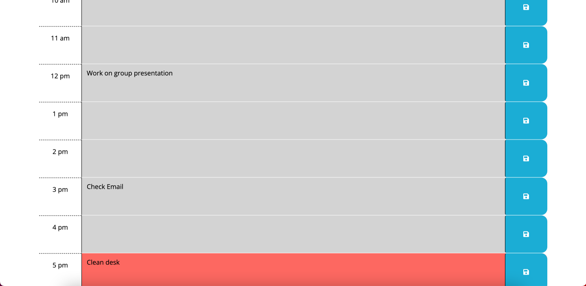

# work-day-scheduler

The work day scheduler application provides an easy solution for keeping your day organinzed. Depending on the time of day, the rows may appear grey, green, or red. Grey rows represent past hours, red represents the present hour, and green represents any future hours. The user can input any event in the text areas and click a save button. The text will then save to local storage. when the page is reloaded, any events that were saved will return to their text area. The goal of this program is to keep the user organized when it comes to keeping track of their work events.

## Link to the Production Version

https://ndockman.github.io/work-day-scheduler/

